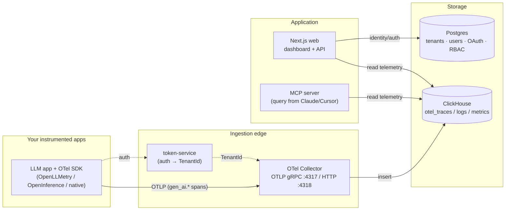

# Architecture

OpenGander is a self-hosted observability platform for GenAI / LLM applications.
It treats LLM telemetry as ordinary OpenTelemetry data: your app exports OTLP,
OpenGander ingests it into ClickHouse, and the dashboard turns it into traces,
prompt/response inspection, token & cost accounting, and per-model performance.

The design is deliberately boring where it should be — standard OTLP, the
standard collector-contrib ClickHouse schema, a normal Postgres control plane —
so that any OTel-compatible instrumentation works without a proprietary SDK.

## System overview

**Data flow:** an instrumented app exports OTLP to the collector → the collector
processes (batch, tenant tagging, redaction) and writes to ClickHouse → the
Next.js app and the MCP server read from ClickHouse for display and agent
queries. Identity and auth never touch the telemetry store — they live in
Postgres.

## Components

| Component | Path | Role |
|---|---|---|
| **Web app** | `apps/web` | Next.js 15 / React 19 dashboard + API. Auth, multi-tenant settings, and the GenAI observability surfaces. |
| **Collector** | `services/collector` | OpenTelemetry Collector config. Receives OTLP (gRPC 4317 / HTTP 4318), batches, tags tenant, redacts, exports to ClickHouse. |
| **Token service** | `services/token-service` | Issues/validates ingestion credentials and resolves them to a `TenantId` for the collector edge. |
| **MCP server** | `services/mcp-server` | Model Context Protocol server so Claude/Cursor can query your telemetry directly. |
| **ClickHouse** | `infra/clickhouse/init.sql` | Telemetry store — the OTLP-native schema. |
| **Postgres** | `apps/web/src/lib/db` | Control plane — tenants, users, OAuth 2.1, RBAC, audit (Drizzle ORM). |

Everything runs as containers via a single `docker compose` stack — see
[usage.md](usage.md).

## Telemetry store (ClickHouse)

The schema (`infra/clickhouse/init.sql`) is the standard
`otel-collector-contrib` ClickHouse exporter schema:

- `otel_traces` — spans (this is where GenAI spans land)
- `otel_logs` — logs
- `otel_metrics_sum` / `_gauge` / `_histogram` — metrics

Each table is multi-tenant: `TenantId` is **materialized** from
`ResourceAttributes['TenantId']`, tables are partitioned per tenant, and a
30-day TTL drops old partitions automatically.

### Why GenAI "just fits"

A GenAI span is an ordinary OTLP span whose payload lives in `gen_ai.*`
attributes (per the [OpenTelemetry GenAI semantic conventions](https://github.com/open-telemetry/semantic-conventions-genai)).
It lands in `otel_traces.SpanAttributes` with **no schema change**. Examples:

| Attribute | Meaning |
|---|---|
| `gen_ai.operation.name` | `chat`, `embeddings`, `execute_tool`, `invoke_agent`, … |
| `gen_ai.provider.name` | `openai`, `anthropic`, `aws.bedrock`, … |
| `gen_ai.request.model` / `gen_ai.response.model` | requested vs. served model |
| `gen_ai.usage.input_tokens` / `output_tokens` | token counts |
| `gen_ai.input.messages` / `gen_ai.output.messages` | prompt/response content (opt-in) |

First-class GenAI surfaces (token & cost rollups, per-model latency) are built
as ClickHouse **materialized views** over `otel_traces` — pre-aggregations that
extract these attributes into typed columns. (See *Implementation status*.)

## Control plane (Postgres)

Tenants, users, and auth live in Postgres via Drizzle ORM
(`apps/web/src/lib/db/schema.ts`):

- **Tenants** — organization records with a self-referential `parentTenantId`
  hierarchy (e.g. agency → client).
- **Users & memberships** — users, per-tenant role membership, invites.
- **Auth** — passwordless magic-link sessions, full **OAuth 2.1 + PKCE**
  (for the MCP server and programmatic access), API keys.
- **RBAC** — a role hierarchy (`superadmin` → `admin` → `moderator` → `user`)
  with tenant scoping and superadmin impersonation.
- **Audit** — sensitive actions are recorded for security review.

Keeping identity in Postgres (not the telemetry store) means auth is
transactional and consistent, while telemetry stays an append-only analytical
firehose — the two have very different access patterns.

## Multi-tenancy & the ingestion edge

Every span is attributed to a tenant via `ResourceAttributes['TenantId']`, which
ClickHouse materializes and partitions on. Two ingestion paths set it:

- **Browser / RUM** — short-lived, origin-bound tokens from the token service.
- **Backend LLM apps** — long-lived API keys resolved to a tenant at the edge.

The collector is fronted by a reverse proxy that authenticates the request and
stamps the resolved `TenantId`, so a tenant can't spoof another's data.

## Self-hosting model

The whole platform is a single-box `docker compose` deployment designed to run
on your own hardware — a homelab box or a cheap VPS — with **no cloud
dependency**. Postgres and ClickHouse run as containers with local volumes;
secrets come from an env file; TLS and edge auth are handled by a reverse proxy.

## Implementation status

OpenGander is being assembled by harvesting the proven OTLP→ClickHouse pipeline
and multi-tenant auth from a prior product and building the GenAI layer on top.
Honest current state:

| Area | Status |
|---|---|
| ClickHouse OTLP schema (`otel_*`) | ✅ in place |
| OTel Collector + compose stack | ✅ in place |
| Postgres identity / auth / RBAC / OAuth | ⚙️ harvested; coupling cleanup in progress before it builds |
| GenAI rollup views (token/cost/model) | ⬜ planned (data layer) |
| GenAI dashboards (traces, prompt inspector, cost) | ⬜ planned |
| GenAI-themed MCP tools | ⬜ planned |
| Reverse-proxy edge auth for backend API keys | ⬜ planned |

See the repository roadmap / issues for sequencing.
